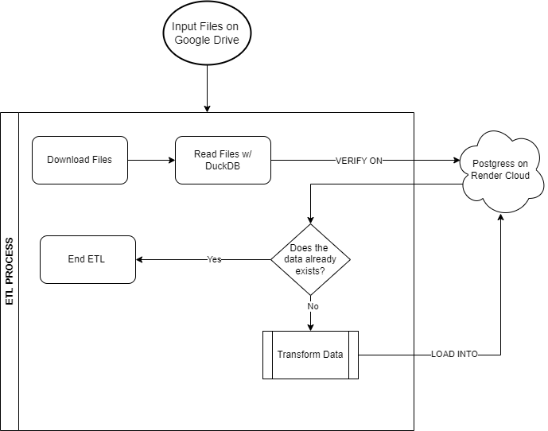

# Objective

Create a complete ETL process, reading from a Google Drive, processing and trasnforming, then loading into a database on cloud.

# Data Stack:

- Google Drive
- Python
- DuckDB
- Poetry
- DBeaver
- Postgress Server instance on Render.com 

# ETL Process:

## Execution

- In order to execute this process, you only need to execute the "pipeline_00.py" file